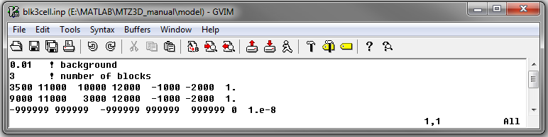
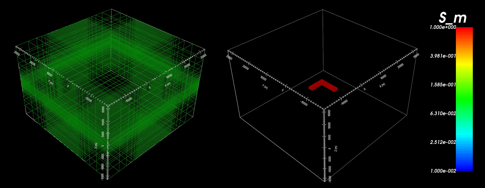

.. _example_model:

Create Model
============

Here, the code **blk3cell.exe** and the input file **blk3cell.inp** (:ref:`see format<mtztem_blk3cell_input>`) are used to create a conductivity model on a tensor mesh. Files relevant to this part of the example are in the sub-folder *model*. Before running this example, you may want to do the following:

	- `Download and open the zip folder containing the entire MTZ3D example <https://github.com/ubcgif/mtztem/raw/master/assets/MTZ3D_example.zip>`__ (if not done already)
	- Learn how to :ref:`run blk3cell from command line<mtztem_model>`
	- Learn the format of the input files :ref:`blk3cell.inp<mtztem_model>`

To generate the model, the following input file was used

The tensor mesh and conductivity model are shown below. The model consists of an L-shaped conductor (:math:`\sigma` = 1 S/m) within a resistive background (:math:`\sigma_b` = 0.01 S/m).

