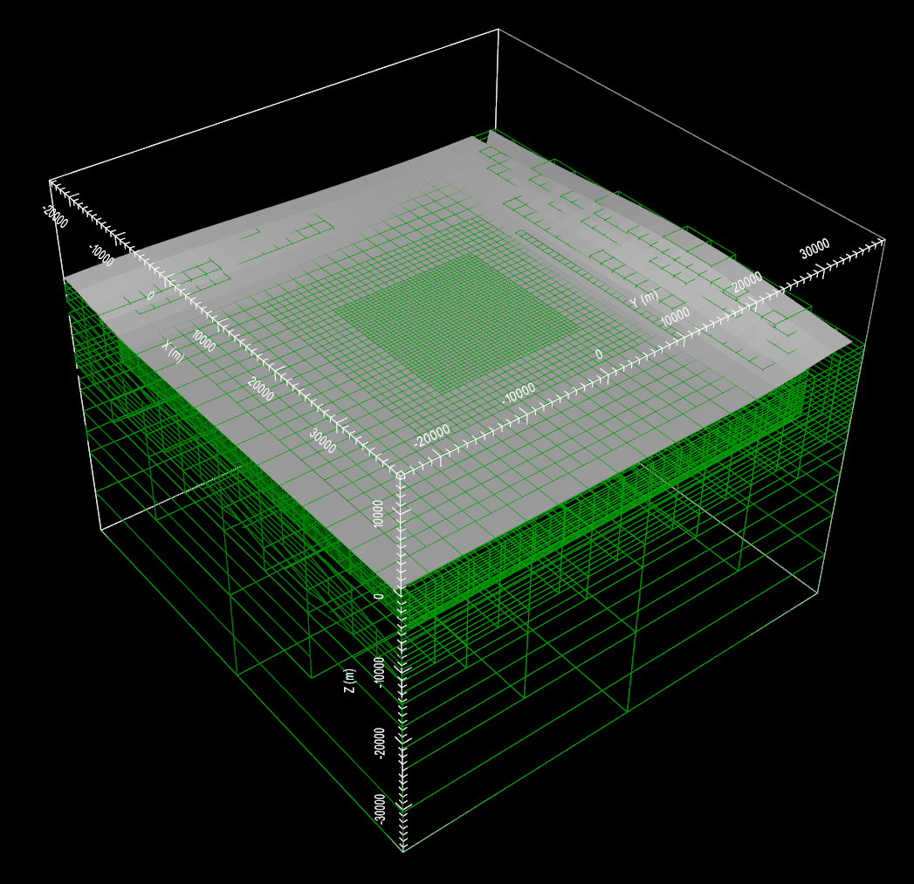
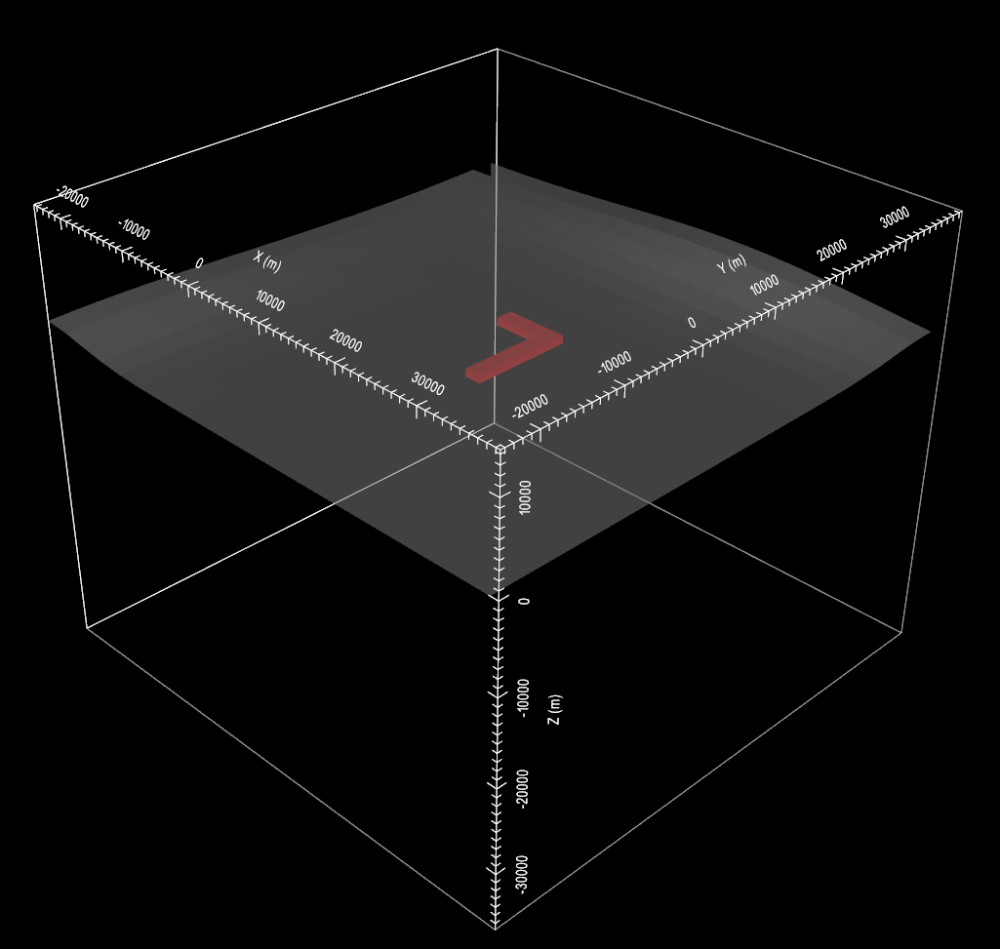
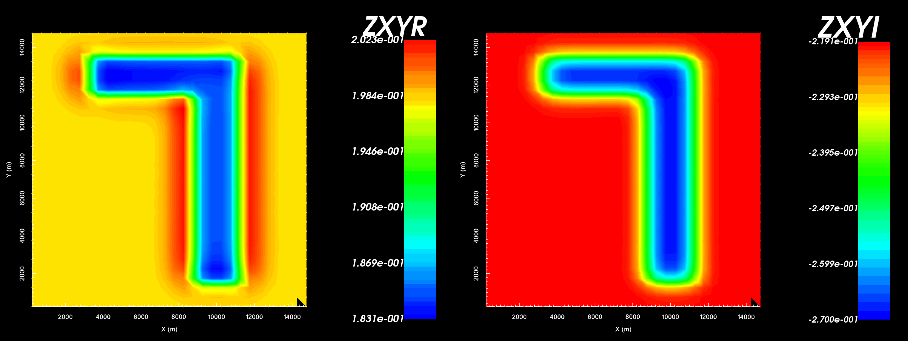
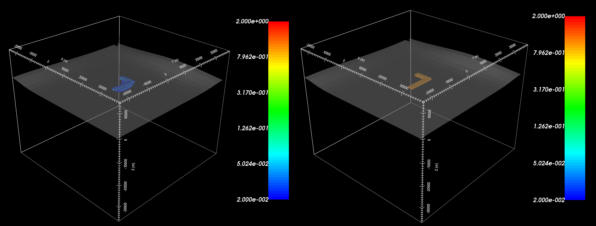

Examples
========

Here, you will be provided with all the necessary tools to:

	- create an Octree mesh based on the survey information
	- create models which exist on Octree meshes
	- predict MT and/or ZTEM data for a synthetic model
	- invert MT and/or ZTEM data

The files provided correspond to the input files and outputs found in the :ref:`"running the programs" <running>` section. As a result, we will link to the aforementioned section in order to provide instructions.

	- `Download files for example <https://github.com/ubcgif/e3dmt/raw/master/assets/e3dmt_example.zip>`__

Creating an Octree mesh
-----------------------

Using the input file and supporting files founding in the "octree_mesh" sub-folder, we were able to create the following mesh. :ref:`Link to instructions for creating Octree meshes <e3dmt_octree>`.

     Octree mesh showing and surface topography. Cells below the surface topography are assigned a value of 1 in the active cells model.

Creating a Model
----------------

Using the input file and supporting files founding in the "octree_model" sub-folder, we were able to create the following model. For this example, the model exists on the octree mesh created in the previous example. :ref:`Link to instructions for creating Octree models <e3dmt_model>`.

     Octree conductivity model (cut-off :math:`\sigma < 1`) and surface topography for reference. All other cells below surface topography correspond to a background conductivity of :math:`\sigma=0.01` S/m.

Forward Modeling MT Data
------------------------

The previous two examples have provided a mesh and conductivity model for which we can model the MT or ZTEM response. Here, we predict the MT response for the survey file provided. All necessary input and supporting files are found in the sub-folder "mt_fwd". Below are the in-phase and quadrature components of a single entry of the impedance tensor. In examining all entries, you will notice that the largest values are in the off-diagonal. Furthermore, the diagonal elements of the impedance tensor are effectively zero, unless data are collected in the vicinity of strong lateral variations in conductivity. :ref:`Link to instructions for running forward model <e3dmt_fwd>`.

     In-phase (left) and quadrature (right) components of impedance tensor element :math:`Z_{xy}` over the L-shaped conductor.

Inverting MT Data
-----------------

Synthetic field data were generated by adding random Gaussian noise to the data predicted in the previous section. For this example, the inversion is run using the iterative solver method (e3dmtinv_iter.exe). Below, we compare the true model to that recovered from the 12 iteration. For this example, we are merely demonstrating how to use the code for a simple example. As such, the parameters using in the inversion may be sub-optimal. It is up to the user to determine an ideal set of inversion parameters and assess the quality of the recovered model(s). :ref:`Link to instructions for running inversion <e3dmt_inv>`.

     Recovered model (left) and true model (right).