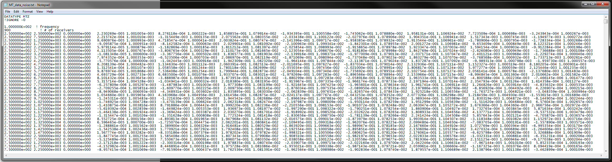

.. _obsFile:

Observations File
=================

This file is input when inverting field-collected data. This file contains the survey information, field observations and data uncertainties. 

.. note::
    - Bolded entries are fixed flags recognized by the Fortran codes and blue hyperlinked entries are values/regular expressions specified by the user
    - Each unique data type, frequency and set of observation locations corresponds to a unique "transmitter"; e.g. 2 transmitters must be specified if the same data are collected at the same locations at 2 different frequencies.
    - Each block containing DATATYPE, FREQUENCY, N_RECV and the data array

The lines of a data file with one or more transmitters are formatted as follows:

| **N_TRX** :math:`\;` :ref:`A<e3dmt_obs_ln1>`
| **!IGNORE** :math:`\;` :ref:`B<e3dmt_obs_ln2>`
|
| **DATATYPE** :math:`\;` :ref:`C<e3dmt_obs_ln3>`
| **FREQUENCY** :math:`\;` :ref:`D<e3dmt_obs_ln4>`
| **N_RECV** :math:`\;` :ref:`E<e3dmt_obs_ln5>`
| :ref:`Data Array<e3dmt_obs_ln6>`
|
| **DATATYPE** :math:`\;` :ref:`C<e3dmt_obs_ln3>`
| **FREQUENCY** :math:`\;` :ref:`D<e3dmt_obs_ln4>`
| **N_RECV** :math:`\;` :ref:`E<e3dmt_obs_ln5>`
| :ref:`Data Array<e3dmt_obs_ln6>`
|
| :math:`\;\;\;\;\;\;\;\; \vdots`
|
| **DATATYPE** :math:`\;` :ref:`C<e3dmt_obs_ln3>`
| **FREQUENCY** :math:`\;` :ref:`D<e3dmt_obs_ln4>`
| **N_RECV** :math:`\;` :ref:`E<e3dmt_obs_ln5>`
| :ref:`Data Array<e3dmt_obs_ln6>`
|
|

     Example data file for MTZ data.

Parameter Descriptions
----------------------

.. _e3dmt_obs_ln1:

    - **(A) Number of transmitters:** In line 1, the number of transmitters/groups of natural source EM data is specified. Example: *N_TRX 3*

.. _e3dmt_obs_ln2:

    - **(B) Flag to ignore data entries:** A regular expression is entered, signifying data in the data structure which is ignored during the inversion. Example: *!IGNORE -0*

.. _e3dmt_obs_ln3:

    - **(C) Data type:**. For the data corresponding to each transmitter, this line sets the type of data. Example: *DATATYPE MTZ*. There are 4 options for DATATYPE:

        - "MTZ" - MT data (Both real and imaginary impedance tensor data)
        - "MTE" - MT data with fixed reference station. Hx, Hy are calculated from the initial model for the reference station
        - "MTT" - ZTEM data (Hx and Hy constant at first receiver location and first receiver station defines base station)
        - "MTH" - ZTEM data (reference is at the data points)
        
.. _e3dmt_obs_ln4:

    - **(D) Frequency:** Frequency at which the corresponding set of field observations are made. Example: *FREQUENCY 1.0000E+002*.

.. _e3dmt_obs_ln5:

    - **(E) Number of receivers:** Number of receivers collecting data at the aforementioned frequency for the aforementioned data type. Example: *N_RECV 900*.

.. _e3dmt_obs_ln6:

    - **Data Array:** Contains the locations and field observations for the data specified by :ref:`data type<e3dmt_obs_ln3>`. The number of lines in this array is equal to the number of receivers. The number of columns depends on the type of data specified. The columns for defined for each array are show :ref:`below<obsFile_data>`.

.. _obsFile_data:

Data Arrays by Type
-------------------

**MT data (DATATYPE = MTZ or MTE):**

Each row in the array contains the elements of the impedance tensor at a particular location separated into real and imaginary components, along with the corresponding uncertainties. The units for MT data are (V/A). The columns for this data format are as follows:

.. math::
    | \; x \; | \; y \; | \; z \; | \;\;\; Z_{11} \; data \;\;\; | \;\;\; Z_{12} \; data \;\;\; | \;\;\; Z_{21} \; data \;\;\; | \;\;\; Z_{22} \; data \;\;\; |

such that each :math:`Z_{ij} \; data` is comprised of 4 columns:

.. math::

    | \; Z^\prime_{ij} \; | \; U^\prime_{ij} \; | \; Z^{\prime \prime}_{ij} \; | \; U^{\prime \prime}_{ij} \; |

where

    - :math:`Z^\prime_{ij}` is the real component of entry i,j of the impedance tensor
    - :math:`Z^{\prime\prime}_{ij}` is the imaginary component of entry i,j of the impedance tensor
    - :math:`U^\prime_{ij}` is the uncertainty on :math:`Z^\prime_{ij}`
    - :math:`U^{\prime\prime}_{ij}` is the uncertainty on :math:`Z^{\prime\prime}_{ij}`

**ZTEM data (DATATYPE = MTT or MTH):**

Each row in the array contains the elements of the transfer function at a particular location separated into real and imaginary components, along with the corresponding uncertainties. Data values and uncertainties are unitless with no normalization factor. The columns for this data format are as follows:

.. math::
    | \; x \; | \; y \; | \; z \; | \;\;\; T_x \; data \;\;\; | \;\;\; T_y \; data \;\;\; |

such that each :math:`T_x \; data` is comprised of 4 columns:

.. math::

    | \; T^\prime_x \; | \; U^\prime_x \; | \; T^{\prime \prime}_x \; | \; U^{\prime \prime}_x \; |

where

    - :math:`T^\prime_x` is the real component of :math:`T_x`
    - :math:`T^{\prime\prime}_x` is the imaginary component of :math:`T_x`
    - :math:`U^\prime_x` is the uncertainty on :math:`T^\prime_x`
    - :math:`U^{\prime\prime}_x` is the uncertainty on :math:`T^{\prime\prime}_x`

and similarly for :math:`y`.

.. important::

	- For **MTT data (ZTEM)**, the first line in the array refers to the base/reference station location. Only the x,y and z locations are required. **However**, each remaining field must be given a flag value "i". *Example for first row:* :math:`350 \;\; 200 \;\; 0 \;\; i \;\; i \;\; i \;\; i \;\; i \;\; i \;\; i \;\; i`
	- For **MTH data (ZTEM)**, measurements Hx, Hy and Hz are taken at the same location. Data and uncertainty values are required for all rows.

