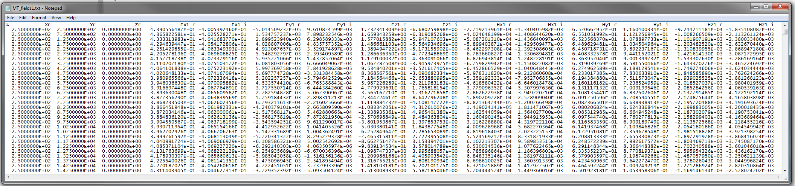

.. _preFileFWD:

Predicted Data (MT3Dfwd)
========================

The data predicted by **MT3Dfwd.exe** is contained within 4 files: **MT_impedance_ri.txt**, **MT_impedance_rho_ph.txt**, **MT_fields1.txt** and **MT_fields2.txt**. Each files contains computed values at the observations points defined in the :ref:`locations file<locationsFile>`.

Impedance Tensor Data
---------------------

The impedance tensor data is found in the file **MT_impedance_ri.txt**. The number of rows within this file is equal to the number of observation locations. The columns within this file are defined as follows:

.. math::
    | \; x \; | \; y \; | \; z \; | \; Z^\prime_{xx} \; | \; Z^{\prime \prime}_{xx} \; | \; Z^\prime_{xy} \; | \; Z^{\prime \prime}_{xy} \; | \; Z^\prime_{yx} \; | \; Z^{\prime \prime}_{yx} \; | \; Z^\prime_{yy} \; | \; Z^{\prime \prime}_{yy} \; |

where

    - :math:`Z^\prime_{ij}` is the real component of entry i,j of the impedance tensor
    - :math:`Z^{\prime\prime}_{ij}` is the imaginary component of entry i,j of the impedance tensor

and the relation between the tensor, the electric fields and the magnetic fields is found in the :ref:`theory section<theory_mt>`

     Example file containing predicted impedance tensor data.

Apparent Resistivity and Phase Data
-----------------------------------

The apparent resistivity and phase data are found in the file **MT_impedance_rho_ph.txt**. The number of rows within this file is equal to the number of observation locations. The columns within this file are defined as follows:

.. math::
    | \; x \; | \; y \; | \; z \; | \; \rho_{xx} \; | \; \phi_{xx} \; | \; \rho_{xy} \; | \; \phi_{xy} \; | \; \rho_{yx} \; | \; \phi_{yx} \; | \; \rho_{yy} \; | \; \phi_{yy} \; |

where

    - :math:`\rho_{ij}` is the apparent resistivity corresponding to entry i,j of the impedance tensor
    - :math:`\phi_{ij}` is the phase corresponding to entry i,j of the impedance tensor

     Example file containing predicted apparent resistivity and phase data.

Fields Data
-----------

The fields for each polarization of the source field is output into the files **MT_fields1.txt** and **MT_fields2.txt**. The format of each file is identical. The number of rows within each file is equal to the number of observation locations. The columns within each file are defined as follows:

.. math::
    | \; x \; | \; y \; | \; z \; | \; E^\prime_{x} \; | \; E^{\prime \prime}_{x} \; | \; E^\prime_{y} \; | \; E^{\prime \prime}_{y} \; | \; E^\prime_{z} \; | \; E^{\prime \prime}_{z} \; | \; H^\prime_{x} \; | \; H^{\prime \prime}_{x} \; | \; H^\prime_{y} \; | \; H^{\prime \prime}_{y} \; | \; H^\prime_{z} \; | \; H^{\prime \prime}_{z} \; |

where

    - :math:`E_i^\prime` is the real component of the electric field along the :math:`i^{th}` cartesian component
    - :math:`E_i^{\prime\prime}` is the imaginary component of the electric field along the :math:`i^{th}` cartesian component
    - :math:`H_i^\prime` is the real component of the magnetic field along the :math:`i^{th}` cartesian component
    - :math:`H_i^{\prime\prime}` is the imaginary component of the magnetic field along the :math:`i^{th}` cartesian component

     Example file containing the predicted electric and magnetic fields at observation locations.

