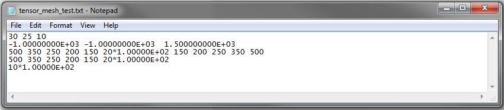
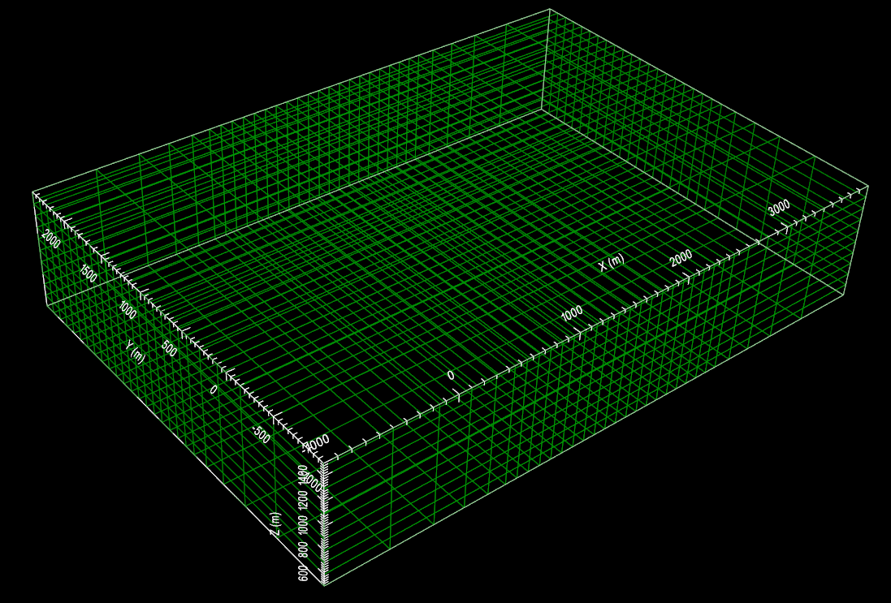

.. _tensorFile:

Tensor Mesh File
================

Tensor meshes are output when creating Octree meshes (**LINK**) and are used in the creation of conductivity models. The format for tensor mesh files is as follows:

|
| :ref:`nx<tensorFile_ln1>` :math:`\;` :ref:`ny<tensorFile_ln1>` :math:`\;` :ref:`nz<tensorFile_ln1>`
| :ref:`x0<tensorFile_ln2>` :math:`\;` :ref:`y0<tensorFile_ln2>` :math:`\;` :ref:`z0<tensorFile_ln2>`
| :ref:`pad_lower<tensorFile_l>` :math:`\;` :ref:`ncx<tensorFile_nc>` * :ref:`dx<tensorFile_d>` :math:`\;` :ref:`pad_upper<tensorFile_u>`
| :ref:`pad_lower<tensorFile_l>` :math:`\;` :ref:`ncy<tensorFile_nc>` * :ref:`dy<tensorFile_d>` :math:`\;` :ref:`pad_upper<tensorFile_u>`
| :ref:`pad_lower<tensorFile_l>` :math:`\;` :ref:`ncz<tensorFile_nc>` * :ref:`dz<tensorFile_d>` :math:`\;` :ref:`pad_upper<tensorFile_u>`
|
|
|

An example of a tensor mesh file and the resulting mesh are shown below

     Example tensor mesh file with different paddings in x, y and z.

     Tensor mesh generated by the file above.

Parameter Descriptions
----------------------

.. _tensorFile_ln1:

	- **nx ny nz:** The number of tensor mesh cells in the x, y and z direction

.. _tensorFile_ln2:

	- **x0 y0 z0:** The x, y and z location denoting the **top southwest corner** of the mesh

.. _tensorFile_nc:

	- **ncx, ncy and ncz:** These parameters denote the number of core mesh cells in the x, y and z direction, respectively

.. _tensorFile_d:

	- **dx, dy and dz:** These parameters denoted the widths of each core mesh cell in the x, y and z direction, respectively

.. _tensorFile_l:

	- **pad_lower:** The individual widths of padding cells, separated by spaces, which are applied. Values should decrease from left to right. The user may leave this blank if they do not wish to pad in this direction.

.. _tensorFile_u:

	- **pad_upper:** The individual widths of padding cells, separated by spaces, which are applied. Values should increase from left to right. The user may leave this blank if they do not wish to pad in this direction.

.. note::

	- In each direction, the number of cells (nx for example) must be equal to the total number of padding cells plus the number of core mesh cells.
	- In the z direction, the ordering of cells is from top to bottom! So *pad_lower* is padding in the up direction.

