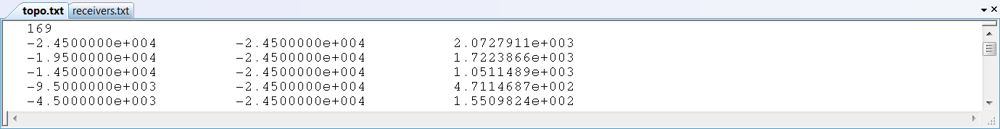

.. _topoFile:

Topography File
===============

The file **topo.txt** contains all topography information. The first line in the topography file gives the number of points of known elevation followed by the list of the elevations (x,y,z). 

     Example topography file

