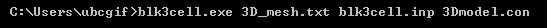
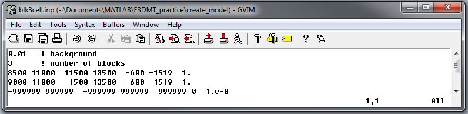
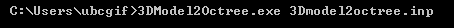
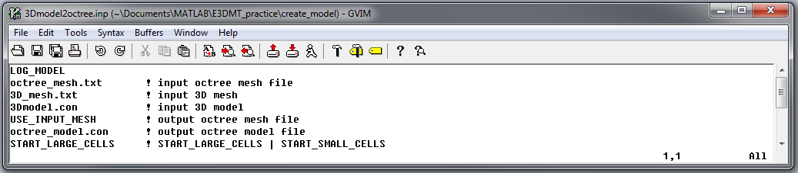

.. _e3dmt_model:

Create Model
============

:ref:`Models<modelFile>` (conductivity/susceptibility/active) used within the forward modeling and inversion codes are generated by carrying out a 2-step process. First, the program **blk3cell.exe** is executed to create a model on the base 3D :ref:`tensor mesh<tensorFile>` (**3D_mesh.txt**) which was output by the code :ref:`MTcreate_octree_mesh_e3d.exe<e3dmt_octree>`; see :ref:`outputs<e3dmt_octree_output>`. This model is comprised of a set of overlapping rectangular blocks whose locations, dimensions and values are specified within **blk3cell.inp**.

Next, **3Dmodel2octree.exe** is used to interpolate the tensor model onto an :ref:`Octree mesh<octreeFile>`. The tensor mesh (**3D_mesh.txt**), tensor :ref:`model<modelFile>` (**3Dmodel.con**) and octree mesh (**octree_mesh.txt**) are specified in the file **3Dmodel2octree.inp**.

.. note:: This workflow can also be used to create a model weights file.

Running blk3cell
----------------

To generate the tensor model on the core tensor mesh, open a command window. In order, enter the path to **blk3cell.exe**, followed by the path to the tensor mesh file name (**3D_mesh.txt**), followed by the path to the input file (**blk3cell.inp**), followed by the desired name (or full path) for the output model file (**3Dmodel.con**), all separated by spaces. 

.. _e3dmt_blk3cell_input:

Input File
^^^^^^^^^^

The file **blk3cell.inp** defines the model (conductivity/susceptibility/active). The user specifies the locations, dimensions and values for a set of blocks. All undefined cells within the mesh are set to the background value. The format for this file is as follows:

|
| :math:`\sigma_b \;\;\;\;\;\;\;\;\;\;\;\;\;\;\;\;\;\;\;\;\;\;\;\;\;\;\;\;\;\;\;\;\;\;\;\;\;\;\;\;\;\;\;\;\;\;\;\;`  ! background conductivity/susceptibility
| :math:`N \;\;\;\;\;\;\;\;\;\;\;\;\;\;\;\;\;\;\;\;\;\;\;\;\;\;\;\;\;\;\;\;\;\;\;\;\;\;\;\;\;\;\;\;\;\;\;\;`  ! number of blocks
| :math:`x_1^{(1)} \;\;  x_2^{(1)} \;\; y_1^{(1)} \;\; y_2^{(1)} \;\; z_1^{(1)} \;\; z_2^{(1)} \;\; m^{(1)} \;\;\;\;\;\;\;\;\;\;\;\;` ! Block 1
| :math:`x_1^{(2)} \;\;  x_2^{(2)} \;\; y_1^{(2)} \;\; y_2^{(2)} \;\; z_1^{(2)} \;\; z_2^{(2)} \;\; m^{(2)} \;\;\;\;\;\;\;\;\;\;\;\;` ! Block 2
| :math:`\;\;\;\;\;\;\;\;\;\;\;\;\;\;\;\;\;\;\;\;\;\;\;\; \vdots`
| :math:`x_1^{(N)} \;\;  x_2^{(N)} \;\; y_1^{(N)} \;\; y_2^{(N)} \;\; z_1^{(N)} \;\; z_2^{(N)} \;\; m^{(N)} \;\;\;\;\;\;\;\;\;\;\;\;` ! Block N
|
|
|

where superscript :math:`(i)` for :math:`i=1,2,...,N` refers to a particular block. :math:`x_1,x_2,y_1,y_2,z_1` and :math:`z_2` define the nodes of each block and :math:`m` defines conductivity/susceptibility value. An example is shown below.

Output
^^^^^^

**blk3cell.exe** outputs a :ref:`model<modelFile>` (**3Dmodel.con**) which contains a single value for each cell in the tensor mesh **3D_mesh.txt**.

.. warning:: It is not advisable to image models on the base tensor mesh as they can be prohibitively large (>> 1M cells).

Running 3Dmodel2Octree
----------------------

To interpolate the model from a tensor mesh to an Octree mesh, open a command window. Enter the path to **3DModel2Octree.exe** followed by a space followed by the path to **3Dmodel2octree.inp**; the mesh and conductivity information is specified in the input file.

Input File
^^^^^^^^^^

The file **Model2Octree.inp** contains the paths to the tensor mesh (**3D_mesh.txt**), tensor model (**3Dmodel.con**) and octree mesh (**octree_mesh.txt**) as well as other necessary parameters. The format of the input file is as follows:

|
| :math:`Model \; Type \;\;\;\;\;\;\;\;\;` ! Either *LIN_MODEL* or *LOG_MODEL*
| :math:`Octree \; mesh\;\;\;\;\;\;\;\;\;` ! File path to Octree mesh
| :math:`Tensor \; mesh\;\;\;\;\;\;\;\;\;` ! File path to tensor mesh
| :math:`Tensor \; model\;\;\;\;\;\;\;\;\;` ! 3D model on tensor mesh
| :math:`Output \; mesh \; name\;\;\;\;\;\;\;\;\;` ! Name for re-meshed Octree mesh or enter *USE_INPUT_MESH*
| :math:`Output \; model \; name\;\;\;\;\;\;\;\;\;` ! File name for conductivity model on Octree mesh
| :math:`Start \; point \;\;\;\;\;\;\;\;\;` ! Either :ref:`START_LARGE_CELLS<e3dmt_octree_ln9>` or :ref:`START_SMALL_CELLS<e3dmt_octree_ln9>`
|
|
|

.. note::

     Consider the following with regards to **line 5**:
          - The edges of structures defined within the underlying tensor mesh may bisect larger cells within the Octree mesh. If an output name is provided, the program will output a new Octree mesh with refined cells such that the edges of structures do not bisect cells. Thus the input and output Octree mesh may have a different number of cells.
          - If *USE_INPUT_MESH* is entered, the model on the underlying tensor mesh is interpolated onto the pre-existing Octree mesh.

An example input file and the resulting conductivity model on the octree mesh are shown below

     Example input file for 3DModel2Octree.exe.

.. figure:: images/model_example.png
     :align: center
     :width: 400

     Octree conductivity model (cut-off :math:`\sigma < 1`) and surface topography for reference. All other cells below surface topography correspond to a background conductivity of :math:`\sigma=0.01` S/m.

Output
^^^^^^

**3Dmodel2Octree.exe** outputs a :ref:`model file<modelFile>` (**Output model name**) which has been interpolated from the base :ref:`tensor mesh<tensorFile>` to the :ref:`Octree mesh<octreeFile>`.

