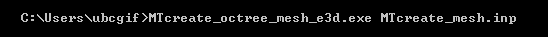
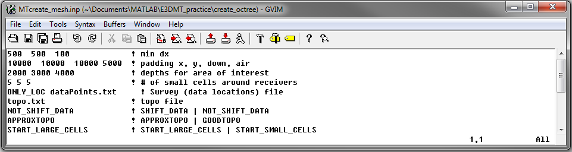
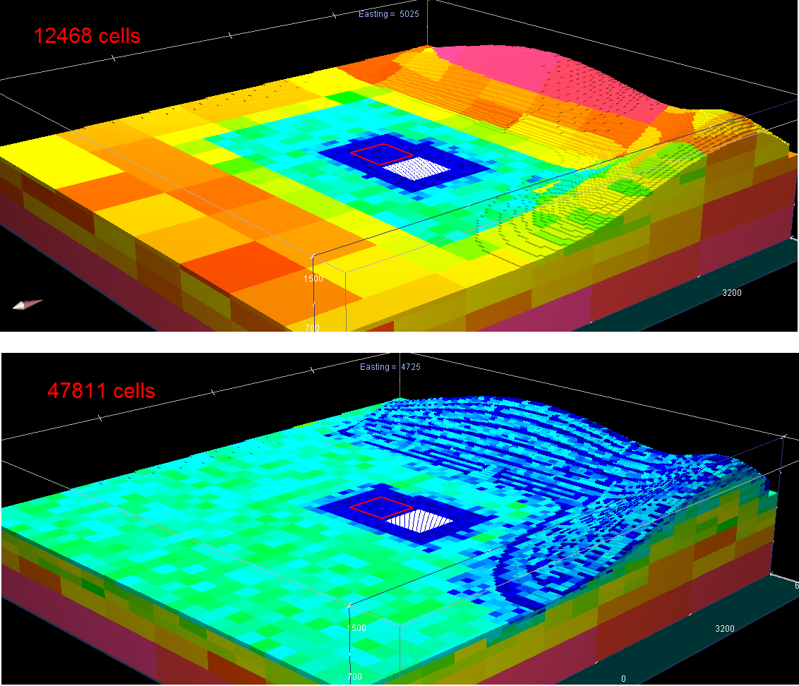

.. _e3dmt_octree:

Create OcTree Mesh
==================

:ref:`OcTree meshes<octreeFile>` used in the E3DMT code are created using the program **MTcreate_octree_mesh_e3d.exe**. Parameters necessary for defining the OcTree mesh are set in the file **MTcreate_mesh.inp**.

Running MTcreate_octree_mesh_e3d
--------------------------------

To generate an OcTree mesh, open a command window. Type the path to the code **MTcreate_octree_mesh_e3d.exe**, followed by a space, followed by the path to the input file.

.. _e3dmt_octree_input:

Input File
----------

The lines of input file (**MTcreate_mesh.inp**) are formatted as follows:

| :ref:`dx dy dz<e3dmt_octree_ln1>`
| :ref:`x_pad y_pad down_pad up_pad<e3dmt_octree_ln2>`
| :ref:`dist_1 dist_2 dist_3<e3dmt_octree_ln3>`
| :ref:`n1 n2 n3<e3dmt_octree_ln4>`
| :ref:`locFile<e3dmt_octree_ln5>`
| :ref:`topoFile<e3dmt_octree_ln6>`
| :ref:`shift_data<e3dmt_octree_ln7>`
| :ref:`interp_topo<e3dmt_octree_ln8>`
| :ref:`start_point<e3dmt_octree_ln9>`
|
|

     Example input file for creating octree mesh.

**Line Descriptions:**

.. _e3dmt_octree_ln1:

    - **dx dy dz:** Minimum cell widths in x, y and z for the base mesh.

.. _e3dmt_octree_ln2:

    - **x_pad y_pad down_pad up_pad:** Distance from the origin in the x, y, downward and upward directions, respectively, that the mesh extends.

.. _e3dmt_octree_ln3:

    - **dist_1 dist_2 dist_3:** Sets the distance from surface topography and receivers in which the cells widths are increased by a factor of 2 in x, y and z. Up to a depth of *dist_1* from surface topography and within a horizontal distance of *dist_1* from any receiver, the smallest cell size is used (set by *dx, dy, dz*). For the following *dist_2* metres, the cell widths are doubled. For the following *dist_3* metres, the cell widths are doubled again. Outside a depth and horizontal distance of *h1+h2+h3*, the cells widths increase by a factor of 2 for every additional layer (see the figure below).

.. _e3dmt_octree_ln4:

    - **n1 n2 n3:** This sets the thicknesses of layers of finest discretization near the receivers. **n1 = 4** means that around each receiver, there is a layer 4 cells thick that uses the finest discretization. This is followed by a layer which is **n2** cells thick, where the cell dimensions are increased by a factor of 2. Likewise for the 3rd layer.

.. _e3dmt_octree_ln5:

    - **locFile:** Contains the locations of the receivers. The user may either enter the file path to an :ref:`observed data<obsFile>` file, or the flag "ONLY_LOC" followed by the path to a :ref:`data points<surveyFile>` file. 

.. _e3dmt_octree_ln6:

    - **topoFile:** If a topography file is available, the file path to the topography file is entered; see :ref:`topography file<topoFile>` for format. In the case of flat topography, the user instead enter "TOPO_CONST", followed by a space, then the elevation of the surface topography; for example "TOPO_CONST 125.5".

.. _e3dmt_octree_ln7:

    - **shift_data:** Set as either "NOT_SHIFT_DATA" or "SHIFT_DATA *filename*". **EXPLANATION REQUIRED**

.. _e3dmt_octree_ln8:

    - **interp_topo:** Set as either "APPROXTOPO" or "GOODTOPO". If "APPROXTOPO" is chosen, there will only be fine cells close to the survey, whereas "GOODTOPO" will place fine cells everywhere on the surface.

.. _e3dmt_octree_ln9:

    - **start_point:** Set as either "START_LARGE_CELLS" or "START_SMALL_CELLS". This line sets the starting point for the mesh generation. Starting the mesh population from large cells greatly reduces initial memory required and is therefore suggested. Large cells are divided in this algorithm to produce the OcTree mesh.

.. figure:: images/octree_example.png
     :align: center
     :width: 400

     Octree mesh showing and surface topography. Cells below the surface topography are assigned a value of 1 in the active cells model.

Approximate versus Good Topography
^^^^^^^^^^^^^^^^^^^^^^^^^^^^^^^^^^

Below, we see the difference between entering "APPROXTOPO" (top) and "GOODTOPO" (bottom) into :ref:`interp_top<e3dmt_octree_ln7>`. For "APPROXTOPO", the mesh ultimately contains a smaller total number of cells, as discretization near the surface is coarser. For "GOODTOPO", the mesh contains a larger total number of cells because the surface topography is discretized to the finest cell size.

.. _e3dmt_octree_output:

Output Files
------------

The program **MTcreate_octree_mesh_e3d.exe** creates 5 output files:

    - **3D_mesh.txt:** the underlying regular :ref:`tensor mesh<tensorFile>`. This mesh is comprised of the smallest cell size and is very large (>> 1M cells). As a result, it is unwise to plot this mesh.

    - **3D_core_mesh.txt:** A 3D regular :ref:`tensor mesh<tensorFile>` defining the core region. 

    - **octree_mesh.txt:** :ref:`OcTree mesh<octreeFile>` used in the forward modeling and inversion codes

    - **active_cells.txt:** :ref:`active cells model<modelFile>` on the OcTree mesh. Cells are active if assigned a value of 1 and inactive if assigned a value of 0 

    - **create_mesh.log:** log file

