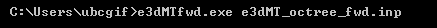

.. _e3dmt_fwd:

Forward Modeling Program
========================

The forward problem is solved using the executable program **e3dMTfwd.exe**. Parameters necessary for running the forward modeling code are set in the file **e3dMT_octree_fwd.inp**.

Running the Program
-------------------

To run the forward modeling program, open a command line window. Type the path to the code **e3dMTfwd.exe**, followed by a space, followed by the path to the input file.

Units:
------

**Input:**

    - **Conductivity model:** S/m
    - **Background susceptibility model:** SI

**Output:**

    - **MT data:** Real and imaginary components of impedance tensor entries (V/A)
    - **ZTEM data:** Real and imaginary components of transfer function entries (unitless)

Input
-----

The lines of input file (**e3dMT_octree_fwd.inp**) are formatted as follows:

| :ref:`OcTree Mesh<e3dmt_fwd_ln1>`
| :ref:`Receiver Locations<e3dmt_fwd_ln2>`
| :ref:`Real Conductivity<e3dmt_fwd_ln3>`
| :ref:`Imaginary Conductivity<e3dmt_fwd_ln4>`
| :ref:`1D Background Conductivity<e3dmt_fwd_ln5>`
| :ref:`Background Susceptibility<e3dmt_fwd_ln6>`
| :ref:`Topography<e3dmt_fwd_ln7>`
|
|

.. figure:: images/e3dmt_fwd_input.png
     :align: center
     :width: 700

     Example input file for forward modeling program.

**Line Descriptions:**

.. _e3dmt_fwd_ln1:

    - **OcTree Mesh:** file path to the OcTree mesh file

.. _e3dmt_fwd_ln2:

    - **Receiver Locations:** file path to the :ref:`survey file<surveyFile>`.

.. _e3dmt_fwd_ln3:

    - **Real Conductivity:** file path to the conductivity model. If complex conductivities are being used, this model represents real-valued conductivities.

.. _e3dmt_fwd_ln4:

    - **Imaginary Conductivity:** If the conductivity model used in the forward simulation is strictly real-valued, the user may enter "NO_IMAG_COND" on this line. Otherwise, the user enters the file path to the imaginary conductivity model.

.. _e3dmt_fwd_ln5:

    - **1D Background Conductivity:** The user may supply the file path to a `1D background conductivity model <http://em1dfm.readthedocs.io/en/latest/content/files/supporting.html#files-for-reference-and-starting-models>`__ . If a homogeneous background conductivity is being used, the user enters "VALUE" followed by a space and a numerical value; example "VALUE 0.01"

.. _e3dmt_fwd_ln6:

    - **Background Susceptibility:** The user may provide the file path to a background susceptibility model on this line. If a constant susceptibility is being used, "VALUE" may be entered and followed by the background susceptibility. For no background susceptibility, the flag "NO_SUS" is used.

.. _e3dmt_fwd_ln7:

    - **Topography:** The user may supply the file path to an active cells model file or type "ALL_ACTIVE". The active cells model has values 1 for cells lying below the surface topography and values 0 for cells lying above.

.. figure:: images/fwd_results.png
     :align: center
     :width: 700

     In-phase (left) and quadrature (right) components of impedance tensor element :math:`Z_{xy}` over the L-shaped conductor.

.. _e3dmt_fwd_output:

Output Files
------------

The program **e3dMTfwd.exe** creates 2 output files:

    - **MT_data.txt:** data predicted using the conductivity model provided

    - **ed3MT_octree_fwd.log:** log file

