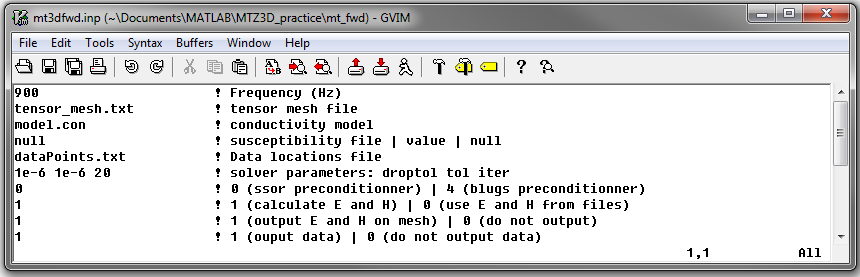

.. _mtztem_fwd:

Forward Modeling Program
========================

The forward problem is solved using the executable program **MT3Dfwd.exe**. Parameters necessary for running the forward modeling code are set in the file **mt3dfwd.inp**. Currently, the MTZTEM package can only forward model MT data at one frequency at a time.

Running the Program
-------------------

To run the forward modeling program, open a command line window. Type the path to the code **MT3Dfwd.exe**, followed by a space, followed by the path to the input file named **mt3dfwd.inp**.

.. figure:: images/mtztem_run_fwd.png
     :align: center
     :width: 600

Units:
------

**Input:**

    - **Conductivity model:** S/m
    - **Background susceptibility model:** SI

**Output:**

    - **MT data:** Real and imaginary components of impedance tensor entries in :math:`V/A`
    - **MT data:** Apparent resistivity and phase for impedance tensor entries in units :math:`\Omega m` and :math:`[ -180^o, 180^o]`, respectively
    - **Electric fields:** Output electric fields at observation locations and/or on mesh are in :math:`V/m`
    - **Magnetic fields:** Output magnetic fields at observation locations and/or on mesh are in :math:`A/m`

Input
-----

The lines of input file (**mtztem_octree_fwd.inp**) are formatted as follows:

|
| :ref:`Frequency<mtztem_fwd_ln1>`
| :ref:`Tensor Mesh<mtztem_fwd_ln2>`
| :ref:`Conductivity Model<mtztem_fwd_ln3>`
| :ref:`Background Susceptibility Model<mtztem_fwd_ln4>`
| :ref:`Locations<mtztem_fwd_ln5>`
| :ref:`droptol<mtztem_fwd_ln6>` :math:`\;` :ref:`tol<mtztem_fwd_ln6>` :math:`\;` :ref:`max_iter<mtztem_fwd_ln6>`
| :ref:`Preconditioner Type<mtztem_fwd_ln7>`
| :ref:`Fields Flag 1<mtztem_fwd_ln8>`
| :ref:`Fields Flag 2<mtztem_fwd_ln9>`
| :ref:`Data Options<mtztem_fwd_ln10>`
|
|

     Example input file for forward modeling program.

**Line Descriptions:**

.. _mtztem_fwd_ln1:

    - **Frequency:** the frequency (in Hz) at which the fields and MT data are modeling

.. _mtztem_fwd_ln2:

    - **Tensor Mesh:** file path to the tensor mesh file

.. _mtztem_fwd_ln3:

    - **Conductivity Model:** file path to the conductivity model.

.. _mtztem_fwd_ln4:

    - **Background Susceptibility Model:** The user may provide the file path to a background susceptibility model on this line. If a constant background susceptibility is being used, enter the value this line. For no background susceptibility, the flag *null* is used.

.. _mtztem_fwd_ln5:

    - **Receiver Locations:** file path to the :ref:`locations file<surveyFile>`.

.. _mtztem_fwd_ln6:

    - **Solver parameters:**
        - **droptol:** sets the threshold for dropping small term in the ILU factorization
        - **tol:** sets tolerance for convergence
        - **max_iter:** sets maximum number of iterations to find convergence

.. _mtztem_fwd_ln7:

    - **Preconditioner Type:** This is specified using a flag value of *0* or *4*.

        - If *0* is entered, a `symmetric successive over-relaxation <https://en.wikipedia.org/wiki/Symmetric_successive_over-relaxation>`__ (SSOR) preconditioner is used.
        - If *4* is entered, a BLUGS preconditioner is used. In general the SSOR preconditioner uses less memory, but converges slower (is recommended for older computers and large problems). The Blugs provides faster convergence, but uses more memory.

.. _mtztem_fwd_ln8:

    - **Fields Flag 1:** This line indicates whether a complete forward modeling is performed, or whether field values have been previously computed and only impedances and/or apparent resistivities and phases need to be computed.
        
        - If *1* is entered, the program computes the E and H fields everywhere.
        - The user enters *0* followed by a set of 4 EDI filenames separated by spaces if the fields have been previously computed; example "*1 e1.dat e2.dat h1.dat h2.dat*". The 1 and 2 indicate that fields were computed using different polarizations of the source field.

.. _mtztem_fwd_ln9:

    - **Fields Flag 2:** This flag determines if the E and H fields computed on the mesh are output.

        - If *0* is entered, the program does not output files containing the fields.
        - If *1* is entered, 4 files are output (*e1.dat, e2.dat, h1.dat* and *h2.dat*).

.. _mtztem_fwd_ln10:

    - **Data Options:** This flag determines whether the program outputs the data at the observation locations.

        - If *0* is entered, the program does not output fields or data at the observation locations
        - If *1* is entered, the program outputs the E and H fields at the observation locations for both polarizations (*MT_fields.txt*), the real and imaginary components of the elements of the impedance tensor (*MT_impedance_ri.txt*) and the apparent resistivities and phases (*MT_impedance_rho_ph.txt*)

.. .. figure:: images/fwd_results.png
..      :align: center
..      :width: 700

..      In-phase (left) and quadrature (right) components of impedance tensor element :math:`Z_{xy}` over the L-shaped conductor.

.. _mtztem_fwd_output:

Output Files
------------

The program **MT3Dfwd.exe** creates a multitude of output files depending on the output flags:

    - **MT_impedance_ri.txt:** Real and imaginary components of elements in the impedance tensor at each observation location
    - **MT_impedance_rho_ph.txt:** Apparent resistivity and phase for elements in the impedance tensor at each observation location
    - **MT_fields1.txt and MT_fields2.txt:** The electric and magnetic fields at each observation locations for different polarizations of the source field. See :ref:`theory<theory_mt>`
    - **e1.dat, d2.dat, h1.dat and h2.dat:** EDI files containing the electric and magnetic fields on the tensor mesh for different polarizations of the source field.
    - **mt3dfwd.log:** log file

