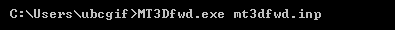

.. _mtztem_fwd:

Forward Modeling Program
========================

The forward problem is solved using the executable program **MT3Dfwd.exe**. Parameters necessary for running the forward modeling code are set in the file **mt3dfwd.inp**. Currently, the MTZTEM package can only forward model MT data at one frequency at a time.

Running the Program
-------------------

To run the forward modeling program, open a command line window. Type the path to the code **MT3Dfwd.exe**, followed by a space, followed by the path to the input file named **mt3dfwd.inp**.

Units:
------

**Input:**

    - **Conductivity model:** S/m
    - **Background susceptibility model:** SI

**Output:**

    - **MT data:** Real and imaginary components of impedance tensor entries in :math:`V/A`
    - **MT data:** Apparent resistivity and phase for impedance tensor entries in units :math:`\Omega m` and :math:`[ -180^o, 180^o]`, respectively
    - **Electric fields:** Output electric fields at observation locations and/or on mesh are in :math:`V/m`
    - **Magnetic fields:** Output magnetic fields at observation locations and/or on mesh are in :math:`A/m`

.. _mtztem_fwd_output:

Output Files
------------

The program **MT3Dfwd.exe** creates a multitude of output files depending on the output flags:

    - **MT_impedance_ri.txt:** Real and imaginary components of elements in the impedance tensor at each observation location
    - **MT_impedance_rho_ph.txt:** Apparent resistivity and phase for elements in the impedance tensor at each observation location
    - **MT_fields1.txt and MT_fields2.txt:** The electric and magnetic fields at each observation locations for different polarizations of the source field. See :ref:`theory<theory_mt>`
    - **e1.dat, d2.dat, h1.dat and h2.dat:** EDI files containing the electric and magnetic fields on the tensor mesh for different polarizations of the source field.
    - **mt3dfwd.log:** log file

