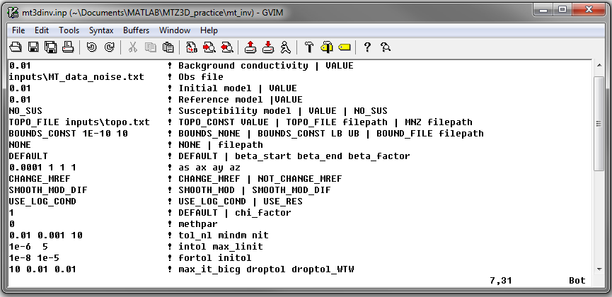

.. _mtztem_inv:

Inversion Program
=================

The inversion of MT and/or ZTEM data at multiple frequencies is done using the program **ZTEM_MT3Dinv.exe**. Parameters for the inversion are set in the file **mt3dinv.inp**.

Running the Program
-------------------

A basic way of running inversion is done by opening a command line window and typing the path to the code **ZTEM_MT3Dinv.exe**, followed by a space, followed by the path to the input file named **mt3dinv.inp**.

.. figure:: images/mtztem_run_inv.png
     :align: center
     :width: 600

For multiple frequencies, the *mpiexec* call can be used for parallelization. In this case, we type in order: *mpiexec*, the flag *-n*, the number of frequencies (*"nFreq"*), the path to the inversion executable and the corresponding input file.

.. figure:: images/mtztem_run_inv_mpi.png
     :align: center
     :width: 700

Units:
------

**Input:**

    - **MT data:** Real and imaginary components of impedance tensor entries (V/A)
    - **MT data:** Apparent resistivity and phase corresponding to impedance tensor entries. Units :math:`\Omega m` and :math:`\phi \in [-180^o, 180^o]` respectively
    - **ZTEM data:** Real and imaginary components of transfer function entries (unitless)
    - **Reference/starting conductivity model:** S/m 
    - **Background susceptibility model:** SI
    - **Sensitivity weights:** unitless

.. important:: The current version of the code requires both components for all entries within the impedance tensor. For example, the user cannot invert only the off-diagonal impedance tensor data. Instead the user must supply large uncertainties for the diagonal data.

**Output:**

    - **Conductivity model:** S/m

Input
-----

The lines of input file (**mt3dinv.inp**) are formatted as follows:

| :ref:`Tensor Mesh<mtztem_inv_ln1>`
| :ref:`Background Conductivity<mtztem_inv_ln2>`
| :ref:`Observation File<mtztem_inv_ln3>`
| :ref:`Initial Model<mtztem_inv_ln4>`
| :ref:`Reference Model<mtztem_inv_ln5>`
| :ref:`Background Susceptibility Model<mtztem_inv_ln6>`
| :ref:`Topography<mtztem_inv_ln7>`
| :ref:`Bounds<mtztem_inv_ln8>`
| :ref:`Sensitivity Weights<mtztem_inv_ln9>`
| :ref:`Trade-Off Parameter Settings<mtztem_inv_ln10>`
| :ref:`alpha_s alpha_x alpha_y alpha_z<mtztem_inv_ln11>`
| :ref:`Reference Model Update<mtztem_inv_ln12>`
| :ref:`Hard Constraints<mtztem_inv_ln13>`
| :ref:`Model Type<mtztem_inv_ln14>`
| :ref:`Chi Factor<mtztem_inv_ln15>`
| :ref:`* Methpar<mtztem_inv_ln16>`
| :ref:`* tol_nl mindm iter_per_beta<mtztem_inv_ln17>`
| :ref:`* into max_linit<mtztem_inv_ln18>`
| :ref:`* fortol initol<mtztem_inv_ln19>`
| :ref:`* max_it_bicg droptol droptol_WTW<mtztem_inv_ln20>`
|
|

.. note:: If *DEFAULT* is used on line 15 (Chi Factor), then the default values will be used on lines 16-20 (denoted by an asterisk). If a value is entered on line 15, the flag *DEFAULT* can be used on any subsequent line.

     Example input file for the inversion program.

**Line Descriptions:**

.. _mtztem_inv_ln1:

    - **Tensor Mesh:** file path to the OcTree mesh file

.. _mtztem_inv_ln2:

    - **Background Conductivity:** 

        - The user may supply the file path to a `1D background conductivity model <http://em1dfm.readthedocs.io/en/latest/content/files/supporting.html#files-for-reference-and-starting-models>`__ .
        - If a homogeneous background conductivity is being used, the user enters the value in S/m.

.. _mtztem_inv_ln3:

    - **Observation File:** file path to the :ref:`observed data file<obsFile>`

.. _mtztem_inv_ln4:

    - **Initial Model:** 

        - The user may supply the file path to an initial :ref:`conductivity model<modelFile>`.
        - If a homogeneous conductivity value is being used for all active cells, the user can enter the value in S/m.

.. _mtztem_inv_ln5:

    - **Reference Model:**

        - The user may supply the file path to a reference :ref:`conductivity model<modelFile>`.
        - If a homogeneous conductivity value is being used for all active cells, the user can enter the value in S/m.

.. _mtztem_inv_ln6:

    - **Background Susceptibility Model:**

        - The user may supply the file path to a background :ref:`susceptibility model<modelFile>`.
        - If a homogeneous susceptibility value is being used for all active cells, the user can enter the value in SI.
        - If the Earth is non-magnetic, the user may use the flag "NO_SUS".

.. _mtztem_inv_ln7:

    - **Topography:** Here, the user can choose to specify the cells which lie below the surface topography. Cells above the surface topography are given a value of :math:`\sigma = 10^{-8}` S/m and :math:`\chi=0` SI in the inversion. To set the topography, the user may:

        - use the flag *TOPO_FILE* followed by the file path to a :ref:`topography file<topoFile>`
        - use the flag *TOPO_CONST* followed by the value in meters if a constant elevation is being used
        - use the flag *MNZ* followed by the file path to an :ref:`active cells model file<modelActiveFile>`

.. _mtztem_inv_ln8:

    - **Bounds:** 

        - use the flag "BOUNDS_NONE" for no upper and lower bounds on recovered conductivities
        - use the flag "BOUNDS_CONST" followed by a value for the lower and upper bounds, respectively, to apply the same bounds to all cells (example: *BOUNDS_CONST 1E-10 0.1*)
        - use the flag "BOUNDS_FILE" followed by the file path to a :ref:`bounds file<boundsFile>` 

.. _mtztem_inv_ln9:

    - **Sensitivity Weights:** Here, the user specifies whether sensitivity weighting is applied. To set the sensitivity weighting:

        - use the flag *NONE* if no sensitivity weighting is being applied
        - or provide the filepath to a :ref:`weights file<weightsFile>`

.. _mtztem_inv_ln10:

    - **Trade-Off Parameter Settings:** Here, the user specifies the protocols for the `trade-off parameter <http://giftoolscookbook.readthedocs.io/en/latest/content/fundamentals/Beta.html>`__ (:math:`\beta` ) between the data misfit and the model objective function. The protocols for the trade-off parameter are specified by three values: *beta_max* (starting :math:`\beta`), *beta_min* (lowest :math:`\beta` before inversion is terminated) and *beta_factor* (fractional decrease in :math:`\beta` each iteration - value between 0 and 1). There are two options for setting the trade-off parameter:

        - use the flag *DEFAULT*. In this case, where :math:`\mathbf{J}` is the sensitivity matrix, :math:`\mathbf{W}` is a linear regularization operator and :math:`\mathbf{r}` is a random vector:

                                .. math::
                                    \begin{align}
                                    beta \; start &= 1000 \times \frac{\| Jr \|^2}{\| Wr \|^2} \\
                                    beta \; end &= 10^{-7} \times beta \; start \\
                                    beta \; factor &= 0.16681
                                    \end{align}

        - or enter the values for *beta_start*, *beta_end* and *beta_factor* separated by spaces (example: *1E4 1E-2 0.2* )

.. _mtztem_inv_ln11:

    - **alpha_s alpha_x alpha_y alpha_z:** `Alpha parameters <http://giftoolscookbook.readthedocs.io/en/latest/content/fundamentals/Alphas.html>`__ . Here, the user specifies the relative weighting between the smallness and smoothness component penalties on the recovered models. As a default setting, *alpha_x=alpha_y=alpha_z=1* and *alpha_s=1/h* :math:`\!^2` is suggested, where *h* is the average dimension of cells in the core region.

.. _mtztem_inv_ln12:

    - **Reference Model Update:** Here, the user specifies whether the reference model is updated at each inversion step result:

        - use the flag *CHANGE_MREF* if the reference model is updated at each iteration
        - use the flag *NOT_CHANGE_MREF* for the reference model to remain the same throughout the entire inversion

.. _mtztem_inv_ln13:

    - **Hard Constraints:** Here, the user specifies whether how the reference model is used to constrain the inversion; go to `fundamentals of inversion <http://giftoolscookbook.readthedocs.io/en/latest/content/fundamentals/MrefInSmooth.html>`__ to see how this is implemented. For the MTZTEM package:

        - use the flag *SMOOTH_MOD* to ignore the reference model (essential set :math:`m_{ref}=0` )
        - use the flag *SMOOTH_MOD_DIF* to include :math:`m_{ref}` in the smallness and smoothness penalty terms

.. _mtztem_inv_ln14:

    - **Model Type:** Here, the user specifies whether the model representing the Earth's conductivity is a log-conductivity or electrical resistivity model. Although the output model is a conductivity model, this choice will have an impact on how the sensitivity is computed:

        - use the flag *USE_LOG_COND* to define the model as a log-conductivity model
        - use the flag *USE_RES* to define as an electrical resistivity model

.. note:: It is suggested that *USE_LOG_COND* be used unless there is reason to do otherwise.

.. _mtztem_inv_ln15:

    - **Chi Factor:** The chi factor defines the target data misfit for the inversion. Once the target misfit is reached, the recovered model fits the field observations sufficiently without fitting the noise and the inversion ceases. A chi factor of 1 means the target misfit is equal to the total number of data observations. For more, see `fundamentals of inversion <http://giftoolscookbook.readthedocs.io/en/latest/content/fundamentals/Beta.html#chi-factor>`__ .

.. _mtztem_inv_ln16:

    - **Methpar:** This line is used to specify parallelization options. Currently, only one option is available and this line should be set to a flag of *0* .

.. _mtztem_inv_ln17:

    - **tol_nl mindm iter_per_beta:** Here, the user specifies parameters related to the number of Newton iterations at each trade-off parameter (:math:`\beta` ) value. *tol_nl* is a tolerance on Newton iterations. The model is considered optimal when the gradient components of the current iteration are sufficiently smaller than those of the initial iteration multiplied by the tolerance. *mindm* is the minimum model perturbation. The Newton iterations stop when if the largest value in the current model is smaller than *mindm* . *iter_per_beta* maximum number of Newton iterations for a fixed trade-off parameter. To set these parameters:

        - use the flag *DEFAULT*, in which case *tol_nl* = 0.01, *mindm* = 0.001 and *iter_per_beta* = 5.
        - or set *tol_nl*, *mindm* and *iter_per_beta* in order separated by spaces

.. _mtztem_inv_ln18:

    - **intol max_linit:** Here, the user specifies solver parameters. *intol* specifies the tolerance for the linear solver (ipcg). This parameters find the optimal model perturbation size (typically between 0.001 and 0.1). *max_linit* sets the maximum number of iterations for the linear solver.

        - use the flag *DEFAULT*, in which case *intol* = 0.01 and *max_linit* = 10
        - or set *intol*, and *max_linit* in order separated by spaces

.. _mtztem_inv_ln19:

    - **fortol initol:** the parameter *fortol* sets the stop tolerance for forward and adjoint calculations when evaluating the objective function and gradients. This should be very small (:math:`\sim 10^{-9}` ). *initol* sets the stop tolerance for the forward and adjoint calculations inside the linear solver (ipcg). This tolerance can be larger than “fortol” to save time (typical 0.001 and lower).

        - use the *DEFAULT* flag, in which case *fortol* = :math:`10^{-9}` and *initol* = :math:`10^{-8}`
        - or set *fortol*, and *initol* in order separated by spaces

.. _mtztem_inv_ln20:

    - **max_it_bicg droptol droptol_WTW:** Here, *max_it_bicg* set the maximum number of iterations in BiCGSTAB when performing the forward and adjoint calculations. *droptol* sets the drop tolerance for the ILU preconditioner for the A matrix. And *droptol_WTW* sets the drop tolerance for the ILU preconditioner for the WTW matrix. This is used when the algorithm is looking for optimal model step size, and in the IPCG solver.

        - use the *DEFAULT* flag, in which case *max_it_bicg* = 15, *droptol* = 0.01 and *droptol_WTW* = 0.01
        - or set *max_it_bicg*, *droptol* and *droptol_WTW* in order separated by spaces

.. .. figure:: images/inv_results.png
..      :align: center
..      :width: 700

..      Recovered model (left) and true model (right).

Output Files
------------

The program **mtzteminv.exe** creates the following output files:

    - **inv.con:** recovered conductivity models

    - **dpred.txt** predicted data for each recovered conductivity model

    - **mtztem_octree_inv.log:** log file for the inversion

    - **mtztem_octree_inv.out:**

