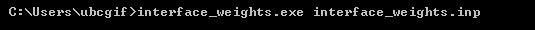
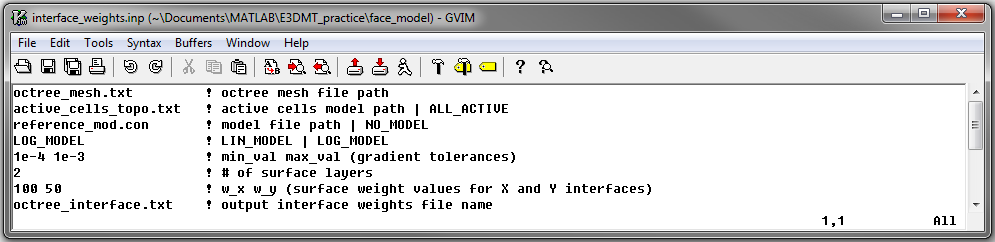

.. _e3dmt_weights:

Create Additional Cell and Face Weights
=======================================

The creation of specific cell and face weights is not required to run the inversion. However, the user may want to weight the relative contributions of cells and/or gradient in certain regions towards the model objective function; see :ref:`theory: inversion <theory_inv>`. The user may also want to apply weights that reduce the impact of near surface artifacts due to receivers.

Generating Model Weights File
-----------------------------

Model weights are applied in the smallness term of the model objective function; see :ref:`theory: inversion <theory_inv>`. To generate a model weights file, use the same workflow described on the :ref:`create model <e3dmt_model>` page. When creating a model weight file, consider the following:

     - All cells **must** be assigned a weight values larger than 0! This is to ensure the problem is sufficiently well-conditioned.
     - Model weight values should be set relative to a value of 1. This is to ensure the relative emphasis on model weights and surface weights is preserved.
     - Large model weights (:math:`w \gg 1` ) are used for cells that we want to match the reference model. Small model weights (:math:`w \ll 1` ) are used for cells to reduce the impact of the reference model on the cells. 

Generating Interface Weights File
---------------------------------

Interface weights are used to preserve the gradients or edges within certain regions of the reference model. They are also used to reduce near-surface artifacts which result from the sensitivity to the receiver locations. Interface weights are applied within the gradient terms of the model objective function; see :ref:`theory: inversion <theory_inv>`. When creating interface weights, consider the following:

     - All interface weights **must** be larger than 0! This is to ensure the problem is sufficiently well-conditioned.
     - Interface weight values should be set relative to a value of 1. This is to ensure the relative emphasis on model weights and surface weights is preserved.
     - Large interface weights (:math:`w \gg 1` ) preserve gradients within reference model. Small interface weights (:math:`w \ll 1` ) results in smoother gradients within the recovered model. 

To generate interface weights on an Octree mesh, open a command window. In order, enter the path to **interface_weights.exe**, followed by the path to the input file (**interface_weights.inp**): 

.. _e3dmt_interface_input:

Input File
^^^^^^^^^^

The file **interface_weights.inp** sets the parameters used to create the interface weights file. The lines within the input file are as follows:

|
| :ref:`OcTree Mesh<e3dmt_weight_ln1>`
| :ref:`Active Cells<e3dmt_weight_ln2>`
| :ref:`Weight Model<e3dmt_weight_ln3>`
| :ref:`Mapping Type<e3dmt_weight_ln4>`
| :ref:`Gradient Tolerance<e3dmt_weight_ln5>`
| :ref:`# Surface Layers<e3dmt_weight_ln6>`
| :ref:`Horizontal Surface Weights<e3dmt_weight_ln7>`
| :ref:`Output Name<e3dmt_weight_ln8>`
|
|

     Example input file for creating interface weights.

**Line Descriptions:**

.. _e3dmt_weight_ln1:

    - **OcTree Mesh:** file path to the OcTree mesh file

.. _e3dmt_weight_ln2:

    - **Active Topography Cells:** Here, the user can choose to specify the cells which lie below the surface topography. To do this, the user may supply the file path to an active cells model file or type "ALL_ACTIVE". The active cells model has values 1 for cells lying below the surface topography and values 0 for cells lying above.

.. _e3dmt_weight_ln3:

    - **Weight Model:** Here, the user provides reference model containing the conductivity structures they would like to preserve. The flag "NO_MODEL" may be used if only surface weighting is applied.

.. _e3dmt_weight_ln4:

    - **Mapping Type:** Here, the user specifies whether the mapping between the model value and the physical property value on the mesh is linear or logarithmic. To specify, use the flags "LIN_MODEL" or "LOG_MODEL". In the case of E3DMT, the inversion recovers the log-conductivity. As a result, the user should use "LOG_MODEL".

.. _e3dmt_weight_ln5:

    - **Gradient Tolerance:** Here, the user specifies the threshold for the largest gradients that can be preserved followed by a replacement value if the gradient is over the threshold (i.e. *Val1* *Val2*). If we try to preserve very large gradients due to blocky models, we may fit these features at the expense of others. The tolerance threshold and replacement value should be determined from the expected physical property values and cell size. *For log-conductivity and 100m cell widths, a good threshold might be:* :math:`\sigma_{max}/dh`.

.. _e3dmt_weight_ln6:

    - **# Surface Layers:** This represents the first parameter used to apply surface weighting. Here, the user specifies how many cell layers below the surface will have surface weighting in X and Y.

.. _e3dmt_weight_ln7:

    - **Horizontal Surface Weights:** Here, the user specifies the weights on X and Y faces for every layer (from surface layer downwards). Essentially, we are invoking a smoothness along the X and Y directions that decreases with depth. The user must enter a set of decreasing values separated by spaces. The number of values that must be entered is equal to the integer value set on the previous line.

.. _e3dmt_weight_ln8:

    - **Output Name:** File name for the output interface weights file.

Output File
^^^^^^^^^^^

The executable outputs an interface_weights file with the specified output name. This file stores the interface weights in X, Y and Z in a single column; as the number of faces in the X, Y and Z direction are likely different.

