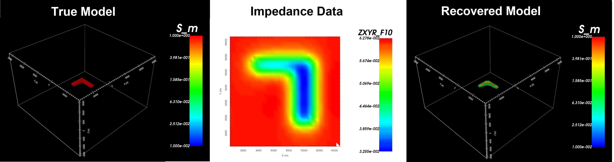

MTZ3D package
=============

MTZ3D is a program library for carrying out forward modelling and inversion of magnetotelluric and Z-axis tipper EM data.

    True model, magnetotelluric data and the recovered model.

Highlights of MTZ3D
^^^^^^^^^^^^^^^^^^^

Highlights of MTZ3D include:

    - the ability to model both magnetotelluric impedance data and Z-axis tipper data
    - the ability to forward model and invert surface or airborne data in 3D
    - the ability to set tolerances for iterative solvers

Contents
^^^^^^^^

 The contents of this manual are as follows:

.. toctree::
    :numbered:
    :maxdepth: 2

    Package overview <content/overview>
    Background theory <content/theory>
    Elements <content/elements>    
    Running the programs <content/runPrograms>
    Examples <content/examples>    
    References <references>

